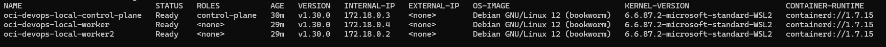
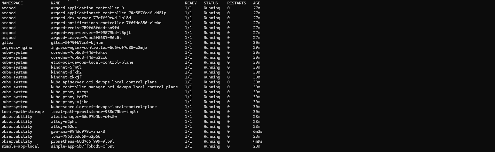
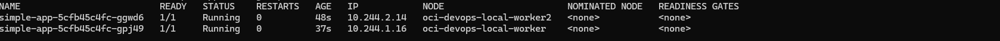
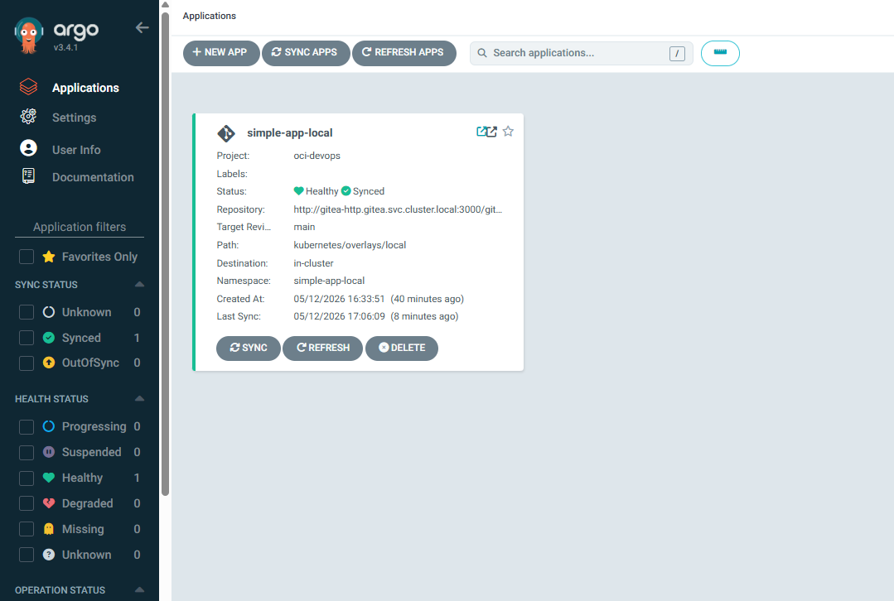
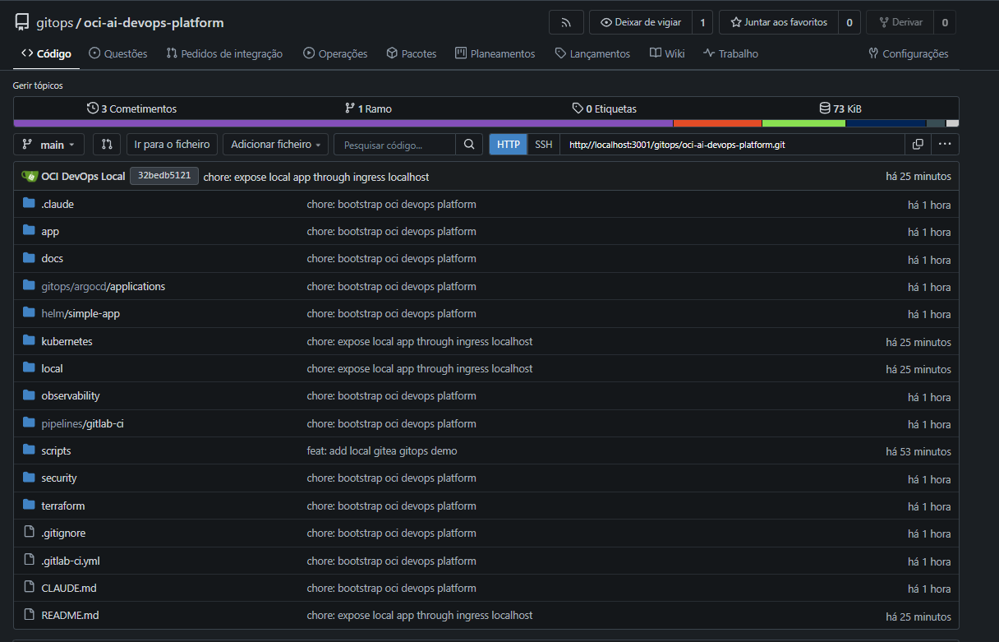
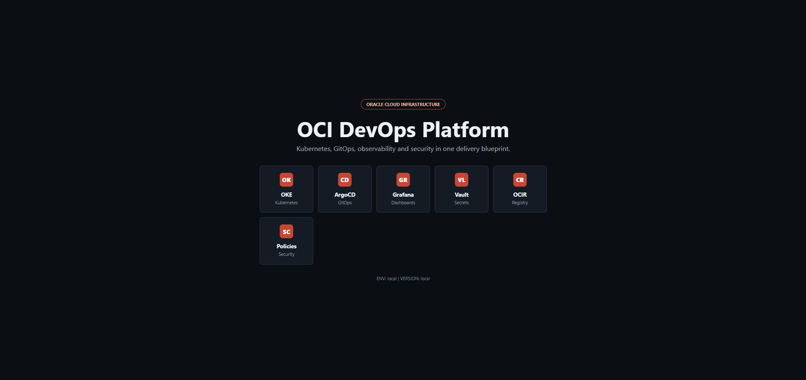
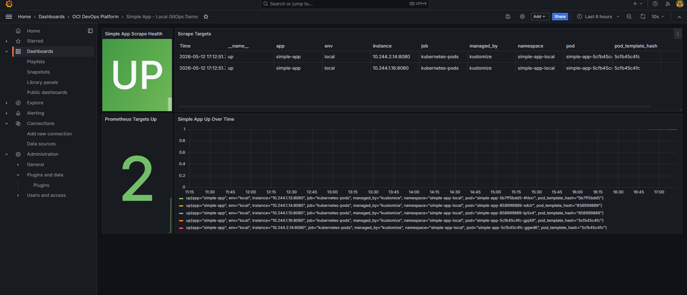
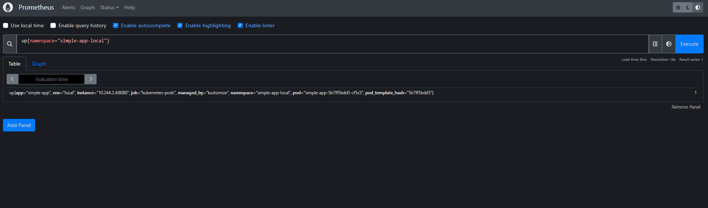
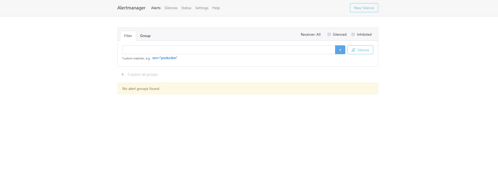

# OCI AI DevOps Platform

Projeto de portfolio DevOps/Cloud com duas formas de uso:

- **Demo local completa**: kind + Gitea + ArgoCD + Ingress + Prometheus + Grafana + Loki + Alloy + Alertmanager.
- **Blueprint OCI**: Terraform para OCI com OKE, OCIR, Vault, Bastion, rede, GitLab CI e GitOps com ArgoCD.

## Demo Local

Fluxo local:

```text
Gitea local -> ArgoCD -> kind -> ingress-nginx -> simple-app
                         |
                         +-> Prometheus / Grafana / Loki / Alloy / Alertmanager
```

Estado validado:

- cluster kind com 1 control-plane e 2 workers;
- `simple-app` com 2 replicas, uma em cada worker;
- app exposta via Ingress em `http://localhost:8080`;
- ArgoCD sincronizando do Gitea local;
- Grafana conectado ao Prometheus;
- Prometheus monitorando a app com `up=1`;
- ferramentas administrativas acessadas por `port-forward`.

### Subir Local

```powershell
.\scripts\delete-local-cluster.ps1
.\scripts\bootstrap-local.ps1
```

App:

```text
http://localhost:8080
```

Servicos administrativos:

```powershell
kubectl -n gitea port-forward svc/gitea-http 3001:3000
kubectl -n argocd port-forward svc/argocd-server 8081:443
kubectl -n observability port-forward svc/grafana 3000:80
kubectl -n observability port-forward svc/prometheus 9090:9090
kubectl -n observability port-forward svc/alertmanager 9093:9093
```

Credenciais locais:

| Servico | URL | Usuario | Senha |
| --- | --- | --- | --- |
| Gitea admin | `http://localhost:3001` | `gitea` | `gitea1234` |
| Gitea GitOps | `http://localhost:3001` | `gitops` | `gitops1234` |
| Grafana | `http://localhost:3000` | `admin` | `admin` |
| ArgoCD | `https://localhost:8081` | `admin` | Secret `argocd-initial-admin-secret` |

Senha atual do ArgoCD:

```powershell
$encoded = kubectl -n argocd get secret argocd-initial-admin-secret -o jsonpath='{.data.password}'
[Text.Encoding]::UTF8.GetString([Convert]::FromBase64String($encoded))
```

## Evidencias Da Demo

### Cluster kind



### Pods em todos os namespaces



### App distribuida nos workers



### ArgoCD sincronizado



### Repositorio no Gitea



### Aplicacao no navegador



### Grafana monitorando a app



### Prometheus com `up=1`



### Alertmanager



## Blueprint OCI

Fluxo OCI:

```text
Developer -> GitLab CI -> OCIR -> GitOps repo -> ArgoCD -> OKE
                                                |
Internet -> OCI Load Balancer -> Ingress -> simple-app
                                                |
                           Prometheus / Grafana / Loki / Alloy
```

Infra provisionada por Terraform:

- VCN;
- subnets publicas, privadas e de Load Balancer;
- Internet Gateway, NAT Gateway e Service Gateway;
- Network Security Groups;
- OKE;
- OCIR;
- Vault;
- Bastion;
- recursos de observabilidade OCI.

## Componentes

| Area | O que entrega |
| --- | --- |
| `.claude/` | Agents e comandos para planejar, gerar, revisar e operar a plataforma com Claude Code. |
| `app/` | Aplicacao HTML simples servida por Nginx e empacotada em container. |
| `terraform/` | Infra OCI: VCN, subnets, gateways, NSGs, OKE, OCIR, Vault, Bastion e observabilidade nativa. |
| `kubernetes/` | Manifests base e overlays Kustomize para local, dev, hml e prod. |
| `helm/` | Chart Helm da aplicacao. |
| `gitops/` | Aplicacoes ArgoCD para sincronizar o cluster com o Git. |
| `pipelines/` | GitLab CI para build, push no OCIR e atualizacao GitOps. |
| `observability/` | Prometheus, Grafana, Loki, Alloy e Alertmanager. |
| `security/` | RBAC, NetworkPolicy, External Secrets e policies de admissao. |
| `docs/` | Documentacao de arquitetura, rede, CI/CD, GitOps, observabilidade e troubleshooting. |
| `scripts/` | Utilitarios para local demo, kubeconfig, login no OCIR e destroy. |

## OCI Quick Start

1. Configure as variaveis OCI em `terraform/environments/<env>/variables.tf`.
2. Copie `terraform.tfvars.example` para `terraform.tfvars` no ambiente desejado.
3. Ajuste os placeholders `<namespace>`, `<region>`, `<tenancy-namespace>`, `<group>` e dominios nos manifests.
4. Provisione a infraestrutura:

```bash
cd terraform/environments/dev
terraform init
terraform apply
```

5. Configure o kubeconfig:

```bash
./scripts/setup-kubeconfig.sh dev
```

6. Faca login no OCIR:

```bash
./scripts/login-ocir.sh
```

7. Deixe o ArgoCD reconciliar o overlay do ambiente ou aplique manualmente:

```bash
kubectl apply -k kubernetes/overlays/dev
```

## Estrutura

```text
oci-ai-devops-platform/
|-- .claude/
|-- app/
|-- terraform/
|-- kubernetes/
|-- helm/
|-- gitops/
|-- pipelines/
|-- observability/
|-- security/
|-- docs/
|-- local/
`-- scripts/
```

## Ambientes

| Ambiente | Namespace | Replicas | Uso esperado |
| --- | --- | --- | --- |
| local | `simple-app-local` | 2 | Demo local com kind e GitOps via Gitea. |
| dev | `simple-app-dev` | 1 | Testes rapidos e validacao de infraestrutura. |
| hml | `simple-app-hml` | 2 | Homologacao proxima de producao. |
| prod | `simple-app-prod` | 3 | Operacao com HPA, PDB e politicas restritivas. |

## Documentacao

- [Arquitetura](docs/architecture.md)
- [Networking](docs/networking.md)
- [GitOps Flow](docs/gitops-flow.md)
- [CI/CD](docs/ci-cd.md)
- [Observabilidade](docs/observability.md)
- [Troubleshooting](docs/troubleshooting.md)
- [Screenshots para Portfolio](docs/screenshots.md)

## Status

Este repositorio esta pronto como demo local e blueprint OCI. Antes de usar em producao, revise CIDRs, IAM, politicas de seguranca, budgets, retencao de logs, certificados TLS, estrategia de backup e secrets reais.
