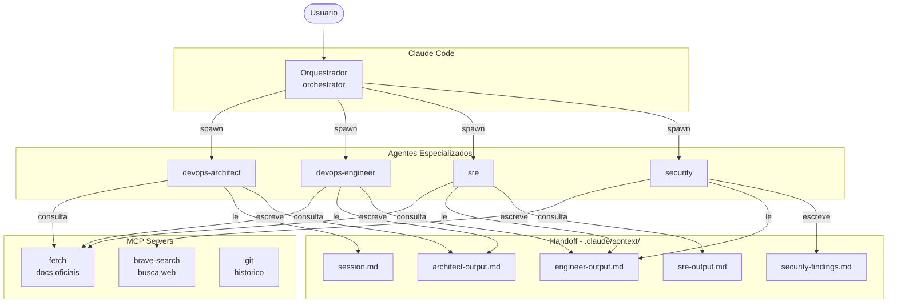

# Arquitetura

Esta plataforma demonstra um fluxo completo de entrega em OCI:

1. Terraform cria rede, OKE, OCIR, Vault, Bastion e recursos auxiliares.
2. CI/CD constroi a imagem da app e publica no OCIR.
3. O pipeline atualiza a tag em Kustomize.
4. ArgoCD sincroniza o cluster com o estado declarado no Git.
5. Prometheus, Grafana, Loki, Alloy e Alertmanager cobrem metricas, logs e alertas.

## Fluxo de requisicao

Internet -> OCI Load Balancer -> Ingress Controller -> Service -> Pods da `simple-app`.

Os worker nodes ficam em subnet privada. O Load Balancer usa subnet publica e encaminha trafego apenas para as portas expostas pelo Ingress.

## Decisoes principais

- Infra por modulos Terraform para reaproveitar entre dev, hml e prod.
- Overlays Kustomize por ambiente para mudar replicas, recursos, hosts e tags.
- GitOps como mecanismo de deploy, mantendo o cluster reconciliado com Git.
- Vault OCI e External Secrets para evitar secrets estaticos no repositorio.

## Arquitetura de Agentes Claude Code

A plataforma inclui uma camada de automacao com Claude Code composta por agentes especializados que se comunicam entre si, consultam documentacao oficial em tempo real e acumulam contexto entre sessoes.

### Topologia dos Agentes



### Fluxo de Handoff

```text
session.md
    └─> architect-output.md   (/plan-architecture)
            └─> engineer-output.md  (/generate-terraform, /generate-k8s)
                    ├─> security-findings.md  (/review-security)
                    └─> sre-output.md         (/sre)
```

Cada agente le o arquivo de saida do agente anterior como contexto e escreve seu proprio arquivo antes de encerrar. Isso permite que o trabalho seja retomado ou delegado sem perder contexto.

### MCP Servers

| Servidor | Funcao | Configuracao |
| --- | --- | --- |
| `fetch` | Busca docs OCI, Terraform Registry, Kubernetes, ArgoCD | Sem chave necessaria |
| `brave-search` | Busca web em tempo real: CVEs, changelogs, novos recursos | Requer `BRAVE_API_KEY` |
| `git` | Inspeciona git log, diff, blame | Requer `uvx` instalado |

Configurados em `.claude/settings.json`.

### Exemplo de Sessao Completa

Objetivo: adicionar Redis como cache da aplicacao.

```
1. Escreva o objetivo em .claude/context/session.md

2. /plan-architecture
   architect le session.md
   architect usa fetch para ler docs do OCI Cache / Redis Operator
   architect documenta decisao e diagrama em architect-output.md

3. /generate-terraform
   engineer le architect-output.md
   engineer gera terraform/modules/redis/
   engineer escreve arquivos e instrucoes em engineer-output.md

4. /generate-k8s
   engineer le architect-output.md
   engineer gera kubernetes/base/redis/ e overlays
   engineer adiciona ao engineer-output.md

5. /review-security
   security le engineer-output.md
   security usa brave-search para CVEs recentes do Redis
   security escreve findings em security-findings.md

6. /generate-terraform (segundo ciclo)
   engineer le security-findings.md
   engineer corrige NetworkPolicy e RBAC
   engineer atualiza engineer-output.md

7. /sre
   sre le engineer-output.md
   sre cria alertas e dashboard para o Redis
   sre escreve SLOs em sre-output.md
```
